## Table of Contents
- [Installation](#Installation)
  - [Before you get started](#Before-you-get-started)
  - [Quick install with Google Cloud Marketplace](#Quick-install-with-Google-Cloud-Marketplace)
  - [Prerequisites](#Prerequisites)
  - [Option1: Marketplace UI Deployment Details](#Option1-Marketplace-UI-Deployment-Details)
  - [Option2: Command line deployment](#Option2-Command-line-deployment)
    - [Prerequisites](#Prerequisites-1)
      - [Set up command line tools](#Set-up-command-line-tools)
      - [Enable required APIs](#Enable-required-APIs)
      - [Complete resource prerequisites](#Complete-resource-prerequisites)
      - [Create a Google Kubernetes Engine cluster](#Create-a-Google-Kubernetes-Engine-cluster)
      - [Configure kubectl to connect to the cluster](#Configure-kubectl-to-connect-to-the-cluster)
      - [Clone this repo](#Clone-this-repo)
      - [Install the Application resource definition](#Install-the-Application-resource-definition)
    - [Install the Application](#Install-the-Application)
      - [Configure the app with environment variables](#Configure-the-app-with-environment-variables)
      - [Create namespace in your Kubernetes cluster](#Create-namespace-in-your-Kubernetes-cluster)
      - [Configure the service account](#Configure-the-service-account)
      - [Add the application parameters to `cli_values_template.yaml`](#Add-the-application-parameters-to-clivaluestemplateyaml)
      - [Expand the manifest template](#Expand-the-manifest-template)
      - [Apply the manifest to your Kubernetes cluster](#Apply-the-manifest-to-your-Kubernetes-cluster)
      - [Post Deployment](#Post-Deployment)
      - [View the app in the Google Cloud Console](#View-the-app-in-the-Google-Cloud-Console)
  - [Detailed Instructions](#Detailed-Instructions)
    - [Minimum Requirements for GKE Cluster:](#Minimum-Requirements-for-GKE-Cluster)
    - [Create a GKE Cluster With Custom Service Account](#Create-a-GKE-Cluster-With-Custom-Service-Account)
      - [Creating a custom service account for your GKE cluster](#Creating-a-custom-service-account-for-your-GKE-cluster)
      - [Configuring the GKE cluster to run as a custom service account](#Configuring-the-GKE-cluster-to-run-as-a-custom-service-account)
    - [Create a GKE Cluster Through CLI](#Create-a-GKE-Cluster-Through-CLI)
    - [Setup OAuth Credentials for IAP (Identity Aware Proxy)](#Setup-OAuth-Credentials-for-IAP-Identity-Aware-Proxy)
    - [Reserve Static External IP Address](#Reserve-Static-External-IP-Address)
    - [Configure DNS A Record](#Configure-DNS-A-Record)
  - [Post Deployment](#Post-Deployment-1)
    - [Configure Identity-Aware Proxy (IAP)](#Configure-Identity-Aware-Proxy-IAP)
    - [Finish Deployment](#Finish-Deployment)
  - [Troubleshooting](#Troubleshooting)
    - ["You don't have access"](#%22You-dont-have-access%22)
    - ["Some components have errors"](#%22Some-components-have-errors%22)
    - [“This site can't provide a secure connection”](#This-site-cant-provide-a-secure-connection)
    - [“Connection Closed”](#Connection-Closed)
    - [“Internal Server Error”](#Internal-Server-Error)
    - [“Error: redirect_uri_mismatch”](#Error-redirecturimismatch)

Custom Governance (CG) is a customizable customer-managed governance platform which lets you coordinate the unique set of rules which make your business work as a native part of your cloud environment.

[Learn more.](https://console.cloud.google.com/marketplace/details/custom-governance/custom-governance)

## About Google Click to Deploy

Popular open stacks on Kubernetes, packaged by Google.

## Questions

Questions about Custom Governance? Go [here](https://docs.google.com/document/d/1o1x8wVrmNwWscnMDtXeTHBjK8cwBCvA6cidoSU0bEzM/edit#heading=h.huk25sxgebcs)

# Installation

## Before you get started

As of early summer 2020 the Custom Governance product is in Early Access stage. We are taking a limited number of new customers. To try out Custom Governance, [please fill out this intake form.](https://docs.google.com/forms/d/1ulI20NPs-S5-pAAZDSlZl4nAOhg5GRERtyoAr0XM6lg/viewform?edit_requested=true)

## Quick install with Google Cloud Marketplace

Get up and running with a few clicks! Install Custom Governance to a
Google Kubernetes Engine cluster using Google Cloud Marketplace. Follow the
[on-screen steps](https://console.cloud.google.com/marketplace/details/custom-governance/custom-governance).

Below are detailed instructions for installing Custom Governance through the Google Cloud Platform (GCP) Marketplace UI.

Custom Governance installed through Marketplace is a Kubernetes application on a Google Kubernetes Engine (GKE) cluster.

**Due to security reasons, we only support running Custom Governance in Google Chrome or Safari. Custom Governance may not be loading properly in all other browsers.**

## Prerequisites
The person performing the onboarding needs to be able to grant the following IAM roles to a service account:
* **Project Editor**
* **Dataflow Worker**
* **Storage Admin**
* **Service Account Token Creator**

The person will also need to:
* Have access to a VM/desktop/laptop that can create a private GKE cluster and ssh if using command line installation if you wish to install Custom Governance in private cluster.
* Have the ability to configure the following resource during the installation process:
  * GKE cluster
  * IAP
  * Global static IP
  * DNS A record configuration
  * **Cloud Asset Owner** role granting to the resources to be monitored


## Option1: Marketplace UI Deployment Details

1. [Create a project](https://cloud.google.com/resource-manager/docs/creating-managing-projects#before_you_begin)
 where Custom Governance can be deployed.
    * Remember to [enable billing in your project](https://cloud.google.com/billing/docs/how-to/modify-project#enable_billing_for_a_project)

1. Enable [Cloud Resource Manager](https://console.cloud.google.com/apis/api/cloudresourcemanager.googleapis.com).
   *   CRM (Cloud Resource Manager) is used by Custom Governance to read Google Cloud Platform resource metadata. It is required for Custom Governance to run.
1. Visit the Marketplace listing for [Custom Governance](https://console.cloud.google.com/marketplace/details/custom-governance/custom-governance) for information on Custom Governance. We will start installation on this page.
   *   When you are ready to deploy click on the “Configure” button, it will take you to the Deployment Configuration UI:

        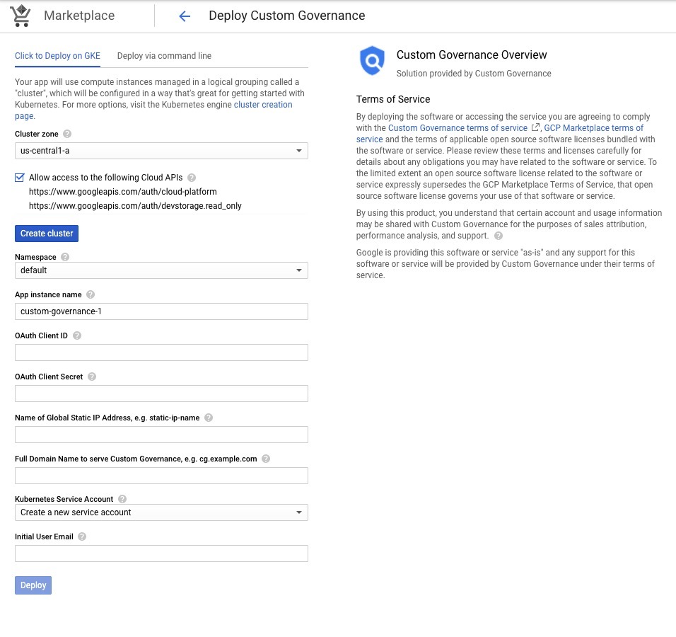

   Please follow the below instructions to finish installation.
   1. **Create a GKE cluster.** The cluster list will contain only clusters that meet the basic requirements to run Custom Governance, you can create a new cluster that meets the basic requirements by clicking “Create a new cluster”.
        * **Please make sure to enable "Allow access to the following Cloud APIs".** This is required for the Cluster to be able to network with GCP services.
      * If you want to [create a custom cluster](#create-a-gke-cluster-through-cli) to meet additional organizational requirements, and/or if you would like to use a custom service account, click [here for instructions and to learn about minimum requirements.](#Minimum-Requirements-for-GKE-Cluster).
   2. **Set up Namespace.** You can use the default namespace or create a new one in the dropdown.
   3. **Set up App instance name.** This is the name of your application instance, e.g. custom-governance.
   4. **Set up OAuth Client ID and OAuth Client Secret.** Please follow the [OAuth section](#Setup-OAuth-Credentials-for-IAP-Identity-Aware-Proxy) and fill in the OAuth Client ID and OAuth Client Secret that you created there.
   5. **Set up Name of Global Static IP Address.** Please follow the instructions here on [how to create a static ip](#Reserve-Static-External-IP-Address) and fill in the name of that ip address, e.g. cg-app-ip.
   6. **Set up Domain Name to serve Custom Governance and Name of Global Static IP Address.** After a static ip is reserved, please follow [the instructions to configure a DNS A Record](#Configure-DNS-A-Record). The Domain name which needs to be filled in here refers to the name that you pointed to the static IP address through the A record. e.g. cg.example.com.
   7. **Set up Kubernetes Service Account. Please select *Create a new service account***
        *   A new Kubernetes service account will be created using cluster edit and read roles to allow access to the Kubernetes Secrets
   8. **Set up Initial User Email.** This will be the user email address that will be deploying/setting up Custom Governance. Custom Governance will check for this email address even after the user has passed through IAP.
   9.  **Click “Deploy” when you are ready.** Deployment usually will take around ten minutes or longer. Even after deployment is successful the cg-ingress may take longer to become ready. This is completely normal. When you find cg-ingress is ready on [cloud console](https://console.cloud.google.com/kubernetes/discovery), it means that the deployment succeeds! You can jump to our [Post Deployment Section](#Post-Deployment) once it's ready. We still have a few steps before you can explore Custom Governance.

## Option2: Command line deployment

You can use [Google Cloud Shell](https://cloud.google.com/shell/) or a local
workstation to follow the steps below.

[](https://console.cloud.google.com/cloudshell/editor?cloudshell_git_repo=https://github.com/GoogleCloudPlatform/click-to-deploy&cloudshell_open_in_editor=README.md&cloudshell_working_dir=k8s/sample-app)

### Prerequisites

#### Set up command line tools

You'll need the following tools in your development environment. If you are
using Cloud Shell, `gcloud`, `kubectl`, Docker, and Git are installed in your
environment by default.

-   [gcloud](https://cloud.google.com/sdk/gcloud/)
-   [kubectl](https://kubernetes.io/docs/tasks/tools/install-kubectl/)
-   [docker](https://docs.docker.com/install/)
-   [git](https://git-scm.com/book/en/v2/Getting-Started-Installing-Git)

Configure `gcloud` as a Docker credential helper:

```shell
gcloud auth configure-docker
```

#### Enable required APIs

1. Enable [Cloud Resource Manager](https://console.cloud.google.com/apis/api/cloudresourcemanager.googleapis.com).
   *   CRM (Cloud Resource Manager) is used by Custom Governance to read Google Cloud Platform resource metadata. It is required for Custom Governance to run.

1. Enable [Kubernetes Engine API](https://console.cloud.google.com/apis/api/container.googleapis.com).
    *   Kubernetes Engine API is required to create a Kubernetes Cluster.

#### Complete resource prerequisites
  Before starting the CLI install you will need the following parameters:
  * [Enable Billing](https://cloud.google.com/billing/docs/how-to/modify-project#enable_billing_for_a_project)
  * [OAuth Client ID](#Setup-OAuth-Credentials-for-IAP-Identity-Aware-Proxy)
  * [OAuth Client Secret](#Setup-OAuth-Credentials-for-IAP-Identity-Aware-Proxy)
  * [Static IP Name](#Reserve-Static-External-IP-Address)
  * [Setup your DNS A Record and Hostname](#Configure-DNS-A-Record)
  * Initial Email: This will be the **user email address** that will be deploying/setting up Custom Governance. Custom Governance will check for this email address even after the user has passed through IAP.

To learn how to create these parameters go through the [installation process above](#marketplace-ui-deployment-details)

#### Create a Google Kubernetes Engine cluster

Create a cluster from the command line. If you already have a cluster that you
want to use, this step is optional.

```shell
export CLUSTER=cg-cluster
export ZONE=us-west1-a

gcloud container clusters create "$CLUSTER" --scopes=https://www.googleapis.com/auth/cloud-platform --zone "$ZONE"
```

#### Configure kubectl to connect to the cluster

```shell
gcloud container clusters get-credentials "$CLUSTER" --zone "$ZONE"
```

#### Clone this repo

Clone this repo and the associated tools repo:

```shell
git clone --recursive https://github.com/GoogleCloudPlatform/click-to-deploy.git
```

#### Install the Application resource definition

An Application resource is a collection of individual Kubernetes components,
such as Services, Deployments, and so on, that you can manage as a group.

To set up your cluster to understand Application resources, run the following
command:

```shell
kubectl apply -f "https://raw.githubusercontent.com/GoogleCloudPlatform/marketplace-k8s-app-tools/master/crd/app-crd.yaml"
```

You need to run this command once for each cluster.

The Application resource is defined by the
[Kubernetes SIG-apps](https://github.com/kubernetes/community/tree/master/sig-apps)
community. The source code can be found on
[github.com/kubernetes-sigs/application](https://github.com/kubernetes-sigs/application).

### Install the Application

#### Configure the app with environment variables
Navigate to the `custom-governance` directory:

```shell
cd click-to-deploy/k8s/custom-governance
```

Choose an instance name and
[namespace](https://kubernetes.io/docs/concepts/overview/working-with-objects/namespaces/)
for the app. In most cases, you can use the `default` namespace.

```shell
export APP_INSTANCE_NAME=cg-app-1
export NAMESPACE=default
```

#### Create namespace in your Kubernetes cluster

If you use a different namespace than `default`, or the namespace does not exist
yet, run the command below to create a new namespace:

```shell
kubectl create namespace "${NAMESPACE}"
```
#### Configure the service account

The application needs a service account in the target namespace with cluster wide permissions to access Kubernetes resources such as Kubernetes Secrets.

Provision a service account and export the name into a variable:

```shell
kubectl create serviceaccount "${APP_INSTANCE_NAME}-sa" --namespace "${NAMESPACE}"
kubectl create clusterrolebinding "${NAMESPACE}-${APP_INSTANCE_NAME}-sa-rb" --clusterrole=cluster-admin --serviceaccount="${NAMESPACE}:${APP_INSTANCE_NAME}-sa"
export SERVICE_ACCOUNT="${APP_INSTANCE_NAME}-sa"
```
#### Add the application parameters to [`cli_values_template.yaml`](cli_values_template.yaml)

Open [`cli_values_template.yaml`](cli_values_template.yaml) inside the `custom-governance` directory:

```shell
vim cli_values_template.yaml
```

Insert the parameters you configured as part of the prerequisites.

1. Generate a base64 version of your OAuth Client ID with this command:

  ```echo -n '<YOUR OAUTH CLIENT ID>' | base64 --wrap=0```

2. Generate a base64 version of your OAuth Client Secret with this command:

  ```echo -n '<YOUR OAUTH CLIENT SECRET>' | base64 --wrap=0```

3. Static IP Name: This is the name of the Static IP you created. For example: cg-app-ip

4. Your certificate hostname is the full DNS address where Custom Governance will be hosted. For example: cg.example.com

5. Service Account: This is the name of the service account you created. For example: cg-app-1-sa
    * You can get this with ```echo $SERVICE_ACCOUNT```

6. Initial Email: This will be the user email address that will be deploying/setting up Custom Governance. Custom Governance will check for this email address even after the user has passed through IAP.


#### Expand the manifest template

Replace the values.yaml template with your template:
1. Rename the current values template

  ```mv chart/custom-governance/values.yaml values_template.yaml```

2. Copy your value template into the chart:

  ```cp cli_value_template.yaml chart/custom-governance/values.yaml```

Use `helm template` to expand the template. We recommend that you save the
expanded manifest file for future updates to your app.

```shell
helm template ${APP_INSTANCE_NAME} chart/custom-governance > ${APP_INSTANCE_NAME}_manifest.yaml
```

#### Apply the manifest to your Kubernetes cluster

Use `kubectl` to apply the manifest to your Kubernetes cluster:

```shell
kubectl apply -f "${APP_INSTANCE_NAME}_manifest.yaml" --namespace "${NAMESPACE}"
```
#### Post Deployment

In order to access your newly deployed Custom Governance instance you must completed
IAP setup.

Follow the instructions in [the Post Deployment section](#Post-Deployment)

#### View the app in the Google Cloud Console

To get the Cloud Console URL for your app, run the following command:

```shell
echo "https://console.cloud.google.com/kubernetes/application/${ZONE}/${CLUSTER}/${NAMESPACE}/${APP_INSTANCE_NAME}?project=${PROJECT_ID}"
```

To view the app, open the URL in your browser.

## Detailed Instructions

### Minimum Requirements for GKE Cluster:

We have minimum requirements for GKE clusters running Custom Governance [following GCP Best practices](https://cloud.google.com/compute/docs/access/create-enable-service-accounts-for-instances#best_practices):

  1. We require a service account with the `editor` IAM role in order to allow Custom Governance to deploy successfully.
     * If you are deploying via [CLI installation](#Command-Line-Deployment) you will need to add the `Kubernetes Engine Admin` IAM role as well.
     * By default the Compute Engine service account is used. If you would like to create a custom service account [click here](#Create-a-GKE-Cluster-With-Custom-Service-Account).
  2. [Configure the instance to run as that service account](#configuring-the-gke-cluster-to-run-as-a-custom-service-account).
  3. Ensure the instance has the `cloud-platform` scope to allow access to Google Cloud APIs. [Learn how to create a cluster with the scope here.](https://www.googleapis.com/auth/cloud-platform)

In addition we recommend these minimum specifications for the cluster:

  * 4 vCPUs
  * 15GB memory

The `n1-standard-4` machine type is a good choice that covers the minimum requirements.

### Create a GKE Cluster With Custom Service Account

#### Creating a custom service account for your GKE cluster

1. From the Cloud Console visit [Menu > IAM & Admin > Service Accounts](https://console.cloud.google.com/iam-admin/serviceaccounts)
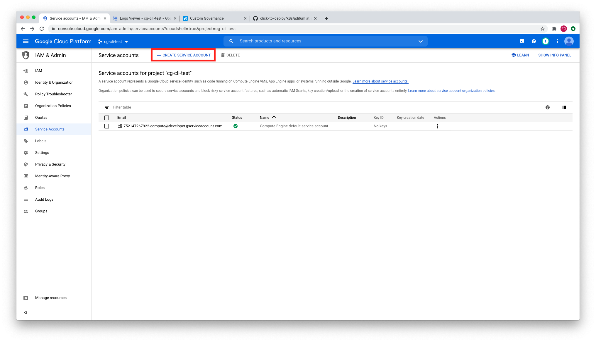
1. Click `Create Service Account` and give the service account a name (e.g. cg-custom-sa)
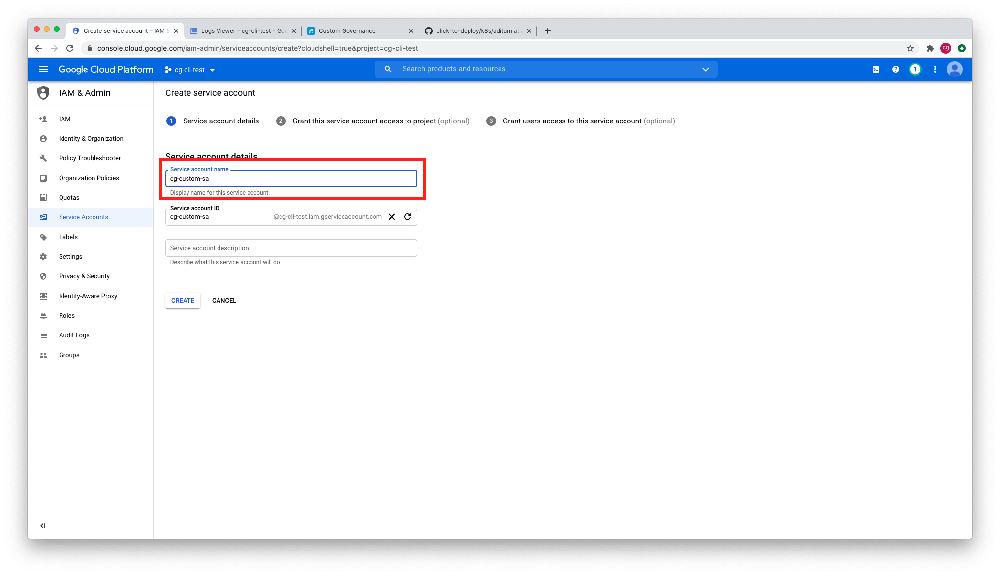
1. Chose the `Editor`, `Storage Admin`, `Dataflow Worker` and `Service Account Token Creator` role for the service account. The service account will be used to run Custom Governance.
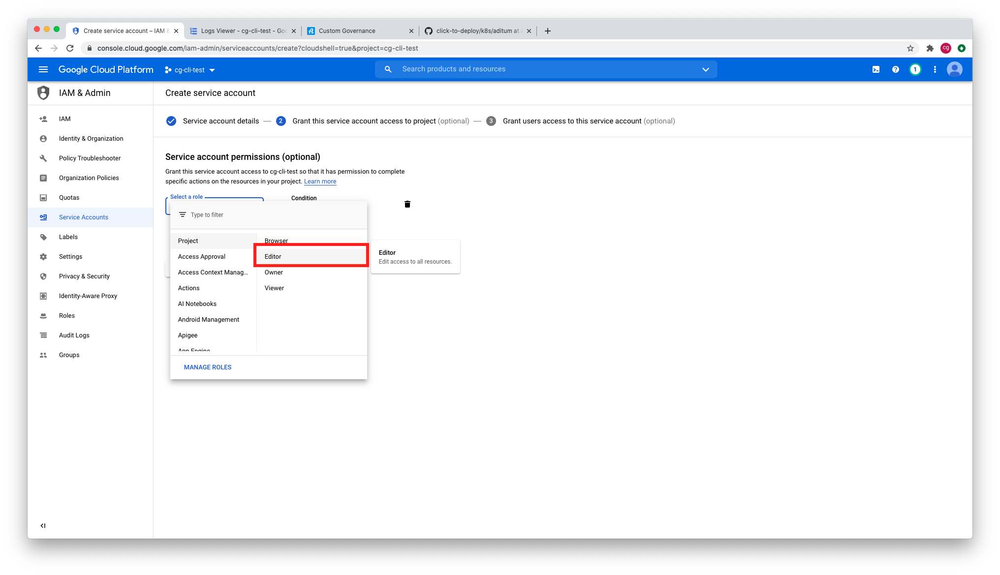
1. Provide users with permission to utilize and administer the service account
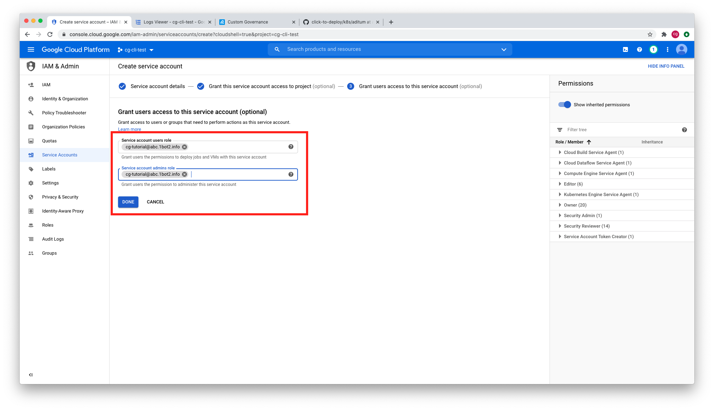

#### Configuring the GKE cluster to run as a custom service account
1. From the Cloud Console visit [Menu > Kubernetes Engine > Clusters](https://console.cloud.google.com/kubernetes/list)
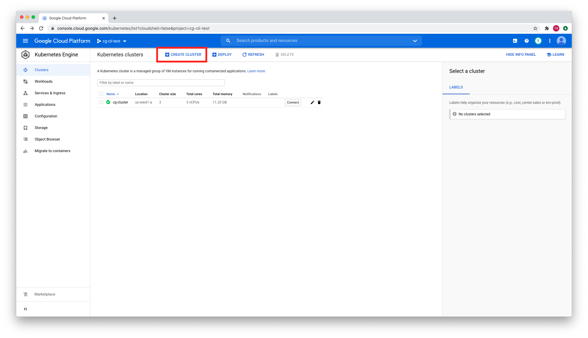
1. Click into the pool (default-pool) -> Security. Select the custom service account you created earlier.
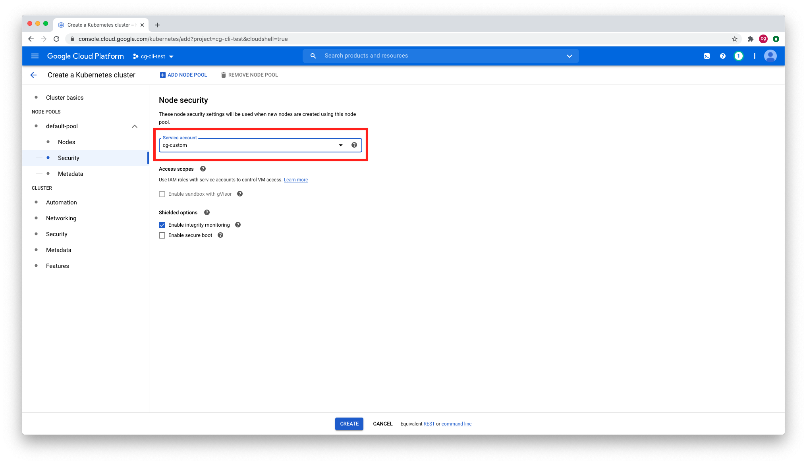
1. Click `Create` to create your cluster with your custom SA!
1. **After this cluster is created, connect to this cluster and add cluster-admin role binding to this custom SA**. Please run the following command to grant your service account with cluster-admin role.
NAMESPACE is your kubernetest namespace in which you plan to install Custom Governance. Please make sure you use the same namespace that you will select in Marketplace Configuration UI, which by default is `default` and SERVICE_ACCOUNT_NAME is your custom SA prefix. For example, if your custom SA is cg-custom-sa@project_id.iam.gserviceaccount.com, SERVICE_ACCOUNT_NAME is cg-custom-sa:

    `kubectl create clusterrolebinding "${NAMESPACE}-${SERVICE_ACCOUNT_NAME}-rb" --clusterrole=cluster-admin --serviceaccount="${NAMESPACE}:${SERVICE_ACCOUNT_NAME}"`

### Create a GKE Cluster Through CLI

  * You can create a cluster with the scope through the [gcloud command-line tool](https://cloud.google.com/sdk/gcloud). You can run this command in the Cloud Shell to create a cluster with the **basic** requirements:

    `gcloud container clusters create [YOUR-CLUSTER-NAME] --scopes=https://www.googleapis.com/auth/cloud-platform --region=[YOUR-REGION]`

  * You can also create a cluster through the [Kubernetes Engine UI](https://console.cloud.google.com/kubernetes) if you wish to customize more on the cluster settings.
    *  [Please see the basic requirements for a GKE cluster running Custom Governance here.](#minimum-requirements-for-gke-cluster)
    *   **The scope can be set through Nodepool Security. Click on Node Pools > Security > Set access for each API > Set Cloud Platform to enable.**

  * [Please click here to continue with the rest installation steps](#marketplace-ui-deployment-details)

### Setup OAuth Credentials for IAP (Identity Aware Proxy)

Learn more about IAP [here](https://cloud.google.com/iap).

Custom Governance uses OAuth for authentication/authorization.
You will need to pass OAuth Credentials to Marketplace UI to properly configure IAP. Follow the instructions to create OAuth Credentials:

   1. Configuring OAuth Consent Screen. Below are detailed steps on how to configure the OAuth Consent Screen.
       1.  Via Cloud Console visit [Menu > API & Services > OAuth consent screen](https://console.cloud.google.com/apis/credentials/consent), select user type and click create.
            * Selecting External will allow accounts outside of your organization to access Custom Governance
            * Selecting Internal will allow accounts only inside your organization to access Custom Governance. **We recommend to choose Internal as the user type.**
       2.  Fill in the *App name*, *User support email* under App information, and *Email addresses* under Developer contact information. Then click save and continue.
            * *App name* is the Application name you want to display on the user consent screen. You can name it as Custom Governance.
            * For *User support email* and *Email address*, you can fill in with your own email address.
       3.  Continue clicking **SAVE AND CONTINUE** Button for the rest and it's done!

   2. Creating OAuth Credentials. Below are detailed steps on how to create the OAuth Credentials.
       1.  Via Cloud Console visit [Menu > API & Services > Credentials](https://console.cloud.google.com/apis/credentials)
       2.  Click *Create Credentials* and select *OAuth client ID*
       3.  Select *Web application* as the Application type
         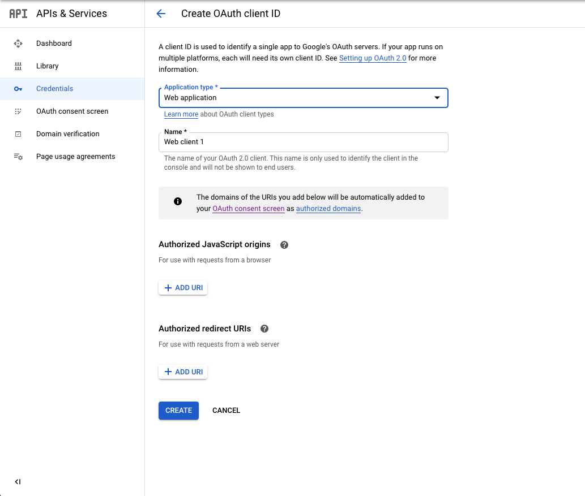
       4.  Create the OAuth Credentials by clicking *Create*
       5. Copy the Client ID from the OAuth confirmation modal
         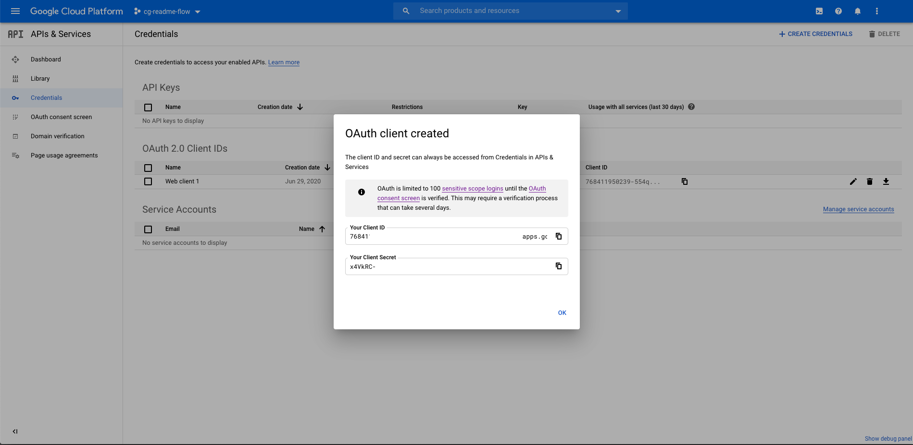
       6. Dismiss the modal and select the OAuth 2.0 Client ID that was just created
       7. Add a Authorized redirect URI that incorporates the client ID that you copied over
         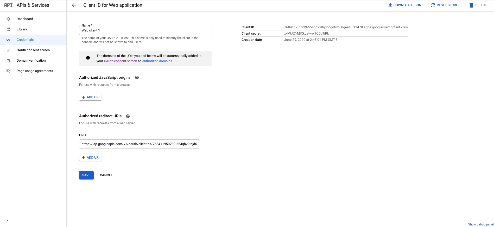

           * Required URI: https://iap.googleapis.com/v1/oauth/clientIds/CLIENT_ID:handleRedirect
           * Where CLIENT_ID is your OAuth Client ID


Once you have created your OAuth Credentials you will need the following to pass into Marketplace UI:

*   OAuth client ID
*   OAuth client secret

[Click here to continue with the rest installation steps](#marketplace-ui-deployment-details)
### Reserve Static External IP Address

*   You can reserve a static external IP address through the [gcloud command-line tool](https://cloud.google.com/sdk/gcloud). In order to meet IAP requirements, we'll need to reserve a **global** IP address. You can run this command in the Cloud Shell. This command will reserve a static IP and give it a name. You'll need this name to be put in the Marketplace UI:

    `gcloud compute addresses create { NAME } --global`

    For example **cg-app-ip**:

    `gcloud compute addresses create cg-app-ip --global`

*   **Or** you can reserve static external IP address through [cloud console UI](https://console.cloud.google.com/networking/addresses/add).
    *   **You MUST choose Global as the IP address type**
    *   The name for the static address will need to be passed into the Marketplace UI. For example, you can name it as **cg-app-ip**.

*  [Click here to continue with the rest installation steps](#marketplace-ui-deployment-details)

### Configure DNS A Record

*    Run the following gcloud command to retrieve your assigned IP address. If you specified a different IP name in the previous step, please replace **cg-app-ip** with your customized name:

      `gcloud compute addresses describe cg-app-ip --global`

*   **Or** retrieve the IP through [cloud console UI](https://console.cloud.google.com/networking/addresses/list). Find the **cg-app-ip** (or your customized name if different) and the External Address is the IP address.

Then you will need to **create an A record with the assigned IP address in your DNS settings**. These DNS settings are usually handled by your host provider. Set the TTL to the minimum amount to allow for quick propagation. The **full domain name** you entered will need to be passed into the Marketplace UI. For example, you can name it as cg.example.com.
The following command can help you quickly find out if your DNS is correctly set up and propagated:

`nslookup <your domain>`

If you utilize Cloud DNS you can follow [these instructions for creating a new record](https://cloud.google.com/dns/docs/quickstart#create_a_new_record).
Once this step is completed, [Click here to continue with the rest installation steps](#marketplace-ui-deployment-details)

## Post Deployment

### Configure Identity-Aware Proxy (IAP)

After Marketplace Deployment has completed successfully you will need to configure
IAP and add any users that will require access to Custom Governance.

*   From the Cloud Console visit [Menu > Security > Identity-Aware-Proxy](https://console.cloud.google.com/security/iap).
*   Enable IAP if it is not already enabled.
*   Review any Errors and Warning as well as review the firewalls.
*   Via Cloud Console you can add users to IAP approved list. Visit
    [Menu > IAM & Admin > IAM](https://console.cloud.google.com/iam-admin/iam) and add
    the *IAP-secured Web App User* role to users you wish to grant access to
    * **Even if you are the Project Owner, you still need to be added to IAP approved list as well.**
    * **Note that IAP may need a couple of minutes to propagate.**

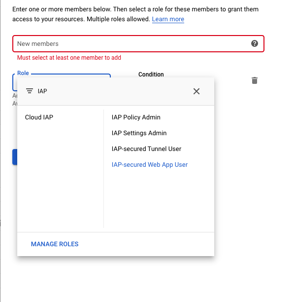

### Finish Deployment
Once deployment is complete you can visit your host address to start the Custom Governance post-deployment process. Custom Governance will walk you through the steps to deploy the necessary resources and permissions required.


## Troubleshooting

### "You don't have access"

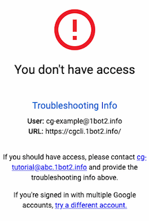

If you are getting this error when trying to access your Custom Governance instance you need to [add the user to the IAP secured user list.](#configure-identity-aware-proxy-iap)

You will need to wait a few minutes for the change to propagate.

### "Some components have errors"

You may see this error in Cloud Console after the application is deployed if the components are not ready. It can take up to half an hour or longer for the Ingress and Deployment to become ready depending on your DNS TTL.

This warning may be accompanied by others:
*   Ingress: "All backend services are in UNHEALTHY state"
*   Deployment: "Does not have minimum availability"

Please allow some time for these warnings to resolve.

### “This site can't provide a secure connection”

The site is not loading your Managed Certificate yet. Make sure you are accessing Cloud Governance by the hostname, not the Load Balancer IP. Wait a few minutes for the Managed Certificate and Load Balancer to become ready. The Managed Certificate relies on your DNS to propagate the A record before it can provision correctly. Certificate provisioning can take up to an hour or even longer. You can check the status of your certificate through kubectl:

    gcloud container clusters get-credentials <cluster name>
    kubectl describe managedcertificate managed-certificate -n <namespace>


###  “Connection Closed”

If going to the hostname results in a “Connection Closed” error, the DNS was not updated in time and certificate provisioning failed. We will need to create a new certificate:


1. Visit the Kubernetes Engine Dashboard and navigate to [Services & Ingress](https://console.cloud.google.com/kubernetes/discovery)
2. Click on the service named “cg-ingress”
3. Locate the Load Balancer under the Ingress section and click on the associated load balancer
4. Edit the Load Balancer configuration
5. Select the Frontend Configuration for editing -> choose the HTTPS frontend configuration (Port 443)
6. Click on the Certificate dropdown and select “Create a new certificate”
7. Enter a name and select “Create Google-managed certificate”, enter your domain name
8. Finish creating the certificate and click “Update” on the load balancer to confirm your changes
9. You should now get through the application
10. Delete the old certificates that are no longer in use


### “Internal Server Error”

If you get an “Internal Server Error” try checking the logs to see what the issue is. You may have not configured the OAuth Credentials properly. You can check the pod logs through Cloud Console or [through kubectl](https://www.google.com/url?q=https://cloud.google.com/kubernetes-engine/docs/quickstart):


```
kubectl get pods
kubectl logs POD_NAME
```


### “Error: redirect_uri_mismatch”

If you are getting this error after logging in you have not[ setup OAuth](https://cloud.google.com/iap/docs/enabling-kubernetes-howto#oauth-credentials) authorized redirect URIs to include the universal redirect URL.

Add to your OAuth authorized redirect URIs:


```
 https://iap.googleapis.com/v1/oauth/clientIds/CLIENT_ID:handleRedirect
```


Where CLIENT_ID is your OAuth Client ID
